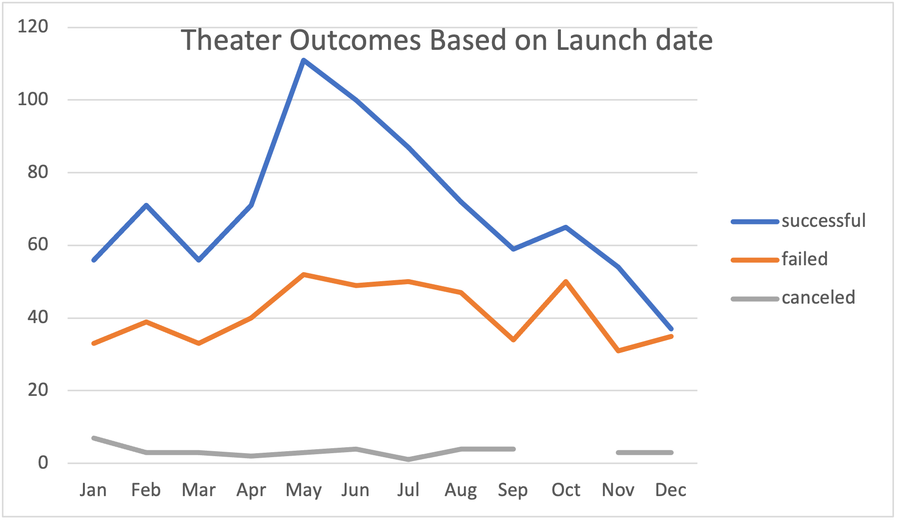
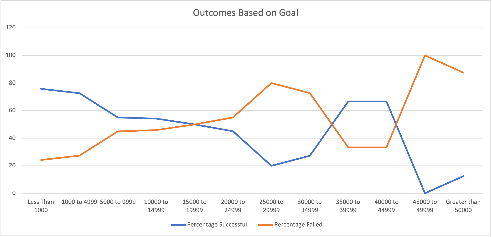

# StarterBook

Overview of Project: The purpose of this analysis is that Louise’s play Fever came close to its fundraising goal in a short amount of time.

Analysis and Challenges: Use knowledge of pivot tables and graphing in Excel to visualize campaign overcomes (“successful”, “failed”, and “canceled”) based on launch date.
Use Excel skills to visualize the percentage of successful, failed, and canceled plays based on the funding goal amount.

Results: Looking at the Theater Outcomes by Launch Date month of May and June has succeed 100.
Outcomes based on goals conclude the percentage of “successful”, “Failed” and “Canceled”.
This dataset also contains Unix Timestamps.
Outcomes based on Launch date table and graphs for all Parent category is included.

Deliverable 1: Outcomes Based on Launch Date Chart

Deliverable 2: Outcomes Based on Goals Chart

